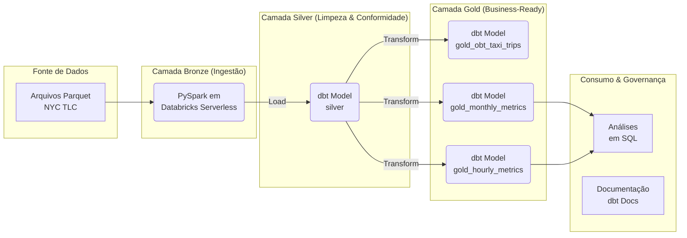

# Case Técnico de Engenharia de Dados - iFood (NYC Taxi)


Este repositório contém a solução completa para o case técnico de engenharia de dados proposto pelo iFood, focado na ingestão, modelagem e análise dos dados de corridas de táxis de Nova York.

O projeto foi construído com ênfase em práticas modernas de engenharia de dados, destacando:
- **Qualidade e Governança:** Através de Contratos de Dados e testes automatizados.
- **Automação de Ponta a Ponta:** Utilizando Infraestrutura como Código (IaC) e CI/CD.
- **Arquitetura Escalável:** Seguindo o padrão ELT e a metodologia Medallion.

## 📜 Documentação Viva do Projeto (dbt Docs)

Uma documentação completa, interativa e sempre atualizada do nosso pipeline de dados está disponível online via GitHub Pages. Ela inclui descrições de modelos, testes de qualidade, e um gráfico de linhagem de dados completo.

**[➡️ Acesse a Documentação Viva aqui](https://packland.github.io/ifood-data-eng-case/)**

## 🏗️ Arquitetura da Solução

Adotamos o padrão **ELT (Extract, Load, Transform)** e a **Arquitetura Medallion** para garantir uma clara separação de responsabilidades e a progressão da qualidade dos dados através do pipeline.



- **Bronze:** A ingestão dos dados brutos é feita por um notebook PySpark, orquestrado por um Job no Databricks. Os dados são armazenados como Delta Tables sem transformações complexas.
- **Silver:** O dbt assume a responsabilidade, aplicando limpezas, conversão de tipos e testes de qualidade para criar uma tabela confiável e auditável.
- **Gold:** O dbt cria *data marts* agregados e denormalizados, prontos para responder diretamente às perguntas de negócio com máxima performance.

### Otimizações de Performance (Particionamento)

Para garantir a performance e a escalabilidade das consultas, especialmente na camada Silver que contém um grande volume de dados, uma otimização chave foi implementada:

-   **Particionamento Físico:** As tabelas `silver` e `gold_obt_taxi_trips` foram fisicamente particionadas pela coluna `pickup_date`. Isso significa que os dados são armazenados em subdiretórios organizados por data no Delta Lake. Quando uma consulta filtra por um período específico (ex: um mês ou uma semana), o Databricks ignora todos os outros diretórios, lendo uma quantidade drasticamente menor de dados e acelerando as transformações e análises subsequentes. Esta otimização foi aplicada diretamente no modelo dbt através da configuração `partition_by`.

## ✨ Foco em Qualidade e Governança

A confiabilidade dos dados foi o pilar central deste projeto, garantida através de:

- **Contratos de Dados (`schema.yml`):** Cada tabela nas camadas Silver e Gold possui um "contrato" que define a estrutura esperada (nome e tipo de cada coluna) e é forçado em tempo de execução com `contract: enforced: true`. Isso previne que dados malformados sejam propagados.
- **Testes Automatizados:** Testes automatizados (implementados com dbt) validam a integridade dos dados, incluindo:
  - `unique` e `not_null` para chaves primárias.
  - `accepted_values` para campos categóricos.
  - Testes de expressão para garantir a aderência a regras de negócio (ex: `total_amount >= 0`).
- **Documentação como Produto:** A documentação não é um artefato estático, mas um produto vivo, gerado e publicado automaticamente a cada atualização do pipeline, garantindo que a governança e o conhecimento sobre os dados estejam sempre acessíveis e atualizados.

## ⚙️ Automação de Ponta a Ponta (CI/CD)

Todo o ciclo de vida do pipeline, desde a infraestrutura até a publicação da documentação, é 100% automatizado, eliminando a necessidade de intervenção manual e garantindo consistência.

- **Infraestrutura como Código (IaC) com Terraform:** O notebook de ingestão e o Job Serverless no Databricks são definidos e gerenciados via Terraform. O estado da infraestrutura é mantido no Terraform Cloud, seguindo as melhores práticas de IaC para ambientes de CI/CD.
- **Orquestração com GitHub Actions:** Um workflow completo (`.github/workflows/end_to_end_pipeline.yml`) orquestra todo o processo a cada `push` na branch `main`:
    1.  **Deploy da Infra:** `terraform apply` garante que o job no Databricks esteja configurado corretamente.
    2.  **Execução do Bronze:** Inicia o job de ingestão PySpark e aguarda sua conclusão com sucesso.
    3.  **Execução de Silver/Gold:** Roda `dbt build` para construir e testar todas as tabelas transformadas.
    4.  **Deploy da Documentação:** Roda `dbt docs generate` e publica o site atualizado no GitHub Pages.

## 🚀 Como Executar o Projeto

### Pré-requisitos

1.  **Conta Databricks:** Acesso a um workspace Databricks.
2.  **Conta Terraform Cloud:** Uma conta no plano gratuito é suficiente para gerenciar o estado.
3.  **Secrets do GitHub:** Configure os seguintes secrets no seu repositório:
    - `DATABRICKS_HOST`: A URL do seu workspace.
    - `DATABRICKS_TOKEN`: Um Personal Access Token do Databricks.
    - `DATABRICKS_HTTP_PATH`: O HTTP Path do seu SQL Warehouse Serverless.
    - `TF_API_TOKEN`: Um token de API gerado no Terraform Cloud.

### Execução Automatizada (Recomendado)

A forma mais simples de executar o projeto é através do workflow de CI/CD:

1.  Faça um fork deste repositório.
2.  Configure os secrets do GitHub conforme listado acima.
3.  Ajuste a organização e o workspace do Terraform Cloud no arquivo `main.tf`.
4.  Faça um `commit` e `push` para a branch `main`. O GitHub Actions irá iniciar o pipeline completo automaticamente.

## 📂 Estrutura do Repositório

```
├── .github/workflows/        # Definição do pipeline de CI/CD.
├── analysis/                 # Scripts SQL com as respostas finais do case.
├── src/
│   ├── bronze_ingestion/     # Código fonte da ingestão (Notebook).
│   └── dbt_project/          # Projeto dbt com todos os modelos e testes.
├── main.tf                   # Definição da infraestrutura (Job Databricks) via Terraform.
└── README.md
```

## 📈 Respostas para as Perguntas do Case

As querys finais que respondem às perguntas do desafio estão na pasta `analysis/`. Elas consultam diretamente as tabelas da camada Gold, demonstrando a simplicidade do consumo dos dados após o trabalho de engenharia.

#### 1. Qual a média de valor total (`total_amount`) recebido em um mês?
*Arquivo: [`analysis/q1_media_valor_total_por_mes.sql`](./analysis/q1_media_valor_total_por_mes.sql)*

| mes_ano    | media_valor_total    |
| :--------- | :------------------- |
| 2023-01-01 | 27.459212356156897   |
| 2023-02-01 | 27.36534006050982    |
| 2023-03-01 | 28.28459309096031    |
| 2023-04-01 | 28.780344804726806   |
| 2023-05-01 | 29.449597559178017   |


#### 2. Qual a média de passageiros (`passenger_count`) por cada hora do dia no mês de maio?
*Arquivo: [`analysis/q2_media_passageiros_por_hora_dia.sql`](./analysis/q2_media_passageiros_por_hora_dia.sql)*

| hora_do_dia | media_passageiros    |
| :---------- | :------------------- |
| 0           | 1.427422724654703    |
| 1           | 1.438027164744961    |
| 2           | 1.4553930974838518   |
| 3           | 1.4524155693100154   |
| 4           | 1.404934503370215    |
| 5           | 1.2844495765973827   |
| 6           | 1.2612810917895663   |
| 7           | 1.2820630247519353   |
| 8           | 1.295685461360555    |
| 9           | 1.3121342121711461   |
| 10          | 1.347728916486939    |
| 11          | 1.3623017676465663   |
| 12          | 1.3761908987056775   |
| 13          | 1.3851633398748793   |
| 14          | 1.3902040165127734   |
| 15          | 1.4019182896470932   |
| 16          | 1.3991033796440837   |
| 17          | 1.3900312110698834   |
| 18          | 1.3836559916964672   |
| 19          | 1.3922698215104687   |
| 20          | 1.4012711016565393   |
| 21          | 1.420006593995343    |
| 22          | 1.4278717844427482   |
| 23          | 1.4225079467123827   |